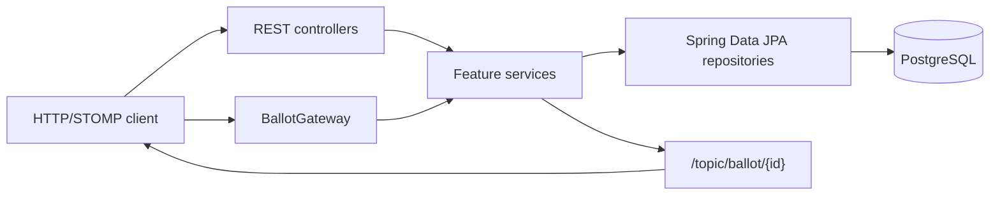
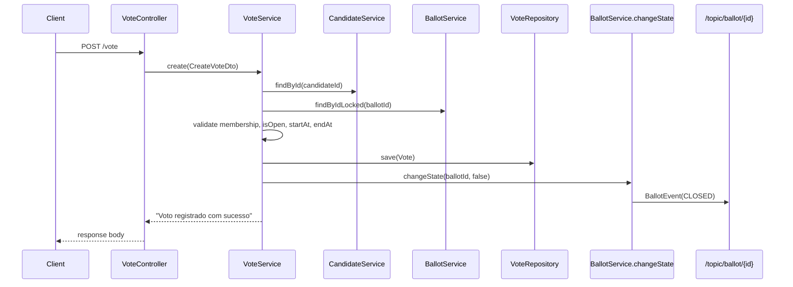

# Vox

This repository contains the server component of the Vox project: a Spring Boot backend for managing users, elections, candidates, ballots, votes, and ballot state notifications. The implementation exposes REST endpoints for the main resources and STOMP/WebSocket endpoints for opening and closing ballots and broadcasting ballot events.

## Implemented Capabilities

- User registration, login, logout, account validation, password reset, profile update, and deletion.
- Election, candidate, and ballot CRUD-style operations.
- Vote registration against a candidate and a ballot, with ballot membership, open-state, and time-window checks.
- Vote result aggregation by election and ballot.
- STOMP/WebSocket ballot open/close commands and `/topic/ballot/{id}` state events.
- JWT authentication from an `Authorization` cookie or `Bearer` header.

## Stack

- Java 26
- Spring Boot 4.0.6
- Spring Web, Spring Security, Spring Data JPA, Spring WebSocket
- PostgreSQL in local/container configuration
- STOMP uses Spring's simple in-memory broker; Spring Cloud Stream/Rabbit dependencies remain in `pom.xml` but no stream binding is implemented
- Maven
- Docker and Docker Compose

## Architecture Overview

The code is organized by feature package under `dev.joaopdias.vox.core`. HTTP controllers delegate to Spring services, services coordinate validation and persistence, and repositories are Spring Data JPA interfaces. JPA entities also provide response DTO mapping methods. WebSocket ballot commands are handled by `BallotGateway` and routed to `BallotService`, which persists state and publishes `BallotEvent` messages through `SimpMessagingTemplate`.



## Documentation

- [English documentation](docs/en/README.md)
- [Documentação em português](docs/pt/README.md)

## Requirements

- Java 26
- Maven wrapper support through `mvnw`/`mvnw.cmd`
- PostgreSQL when running outside tests
- Docker and Docker Compose for containerized execution

## Local Execution

```bash
./mvnw spring-boot:run
```

The default server port is `8080`. The default datasource is `jdbc:postgresql://localhost:5432/vox` with username/password `postgres`/`postgres`.

## Docker Execution

```bash
docker compose up --build
```

`compose.yaml` currently defines the application on port `8080` and PostgreSQL on `5432`. It still contains `server.depends_on` references to `message-br` and `cache`, but those services are not defined in the current file.

## Tests

```bash
./mvnw test
```

## Main Voting Flow


