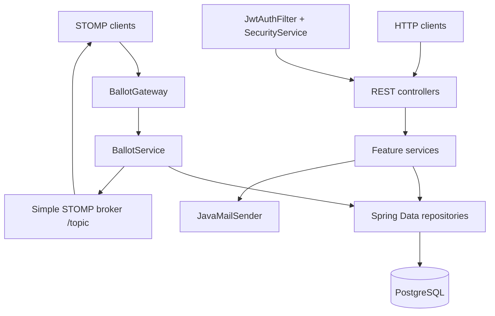

# Vox Backend Documentation

[Root README](../../README.md) | [Português](../pt/README.md)

This repository is the server-side component of Vox. It is a Spring Boot backend whose implemented domain covers users, elections, candidates, ballots, votes, and ballot state notifications. These pages document the behavior that is visible in the current source code.

## Map

- [Architecture](architecture.md)
- [Domain Model](domain-model.md)
- [Voting Flow](voting-flow.md)
- [Elections and Ballots](elections-ballots.md)
- [Concurrency and Transactions](concurrency-transactions.md)
- [Persistence](persistence.md)
- [HTTP API](http-api.md)
- [WebSocket](websocket.md)
- [Validation and Invariants](validation-invariants.md)
- [Testing](testing.md)
- [Configuration and Deployment](configuration-deployment.md)

## High-Level Components

The main service dependencies are direct Spring constructor dependencies. There are no separate application command objects, repository ports, or persistence adapter interfaces in the current implementation.
