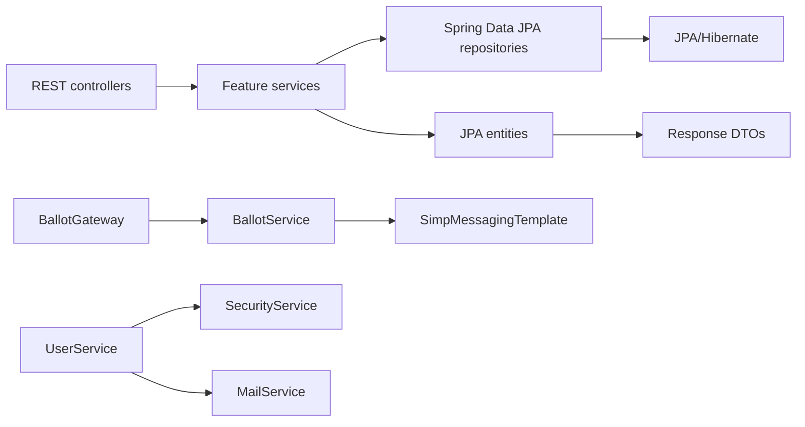
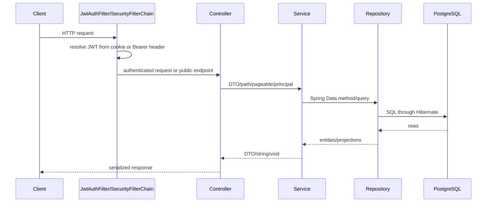

# Architecture

[Documentation Index](README.md) | [Português](../pt/architecture.md)

## Runtime Shape

The application is a Spring Boot application rooted at `dev.joaopdias.vox.VoxApplication`. Feature code lives under `dev.joaopdias.vox.core`, with packages for `user`, `election`, `candidate`, `ballot`, and `vote`. Cross-cutting code is under `dev.joaopdias.vox.shared`, and Spring configuration is under `dev.joaopdias.vox.config`.

The implemented boundary between external interfaces and business operations is the controller/service boundary:

- REST controllers are annotated with `@RestController` and delegate to feature services.
- `BallotGateway` is a STOMP controller annotated with `@Controller` and `@MessageMapping`.
- Services contain the observable business validations and orchestration.
- Repositories are Spring Data JPA interfaces used directly by services.
- Entities are JPA persistence models and also contain `toResponseDto()` mapping methods.

This is not a strict hexagonal or clean architecture implementation because services depend directly on Spring Data repositories, JPA entities expose DTO conversion, and `BallotService` depends directly on `SimpMessagingTemplate`.

## Modules and Responsibilities

`core.user` manages account lifecycle, credentials, validation status, JWT creation/refresh delegation, and email dispatch. `UserService` depends on `UserRepository`, `SecurityService`, and `MailService`.

`core.election` manages elections owned by users. `ElectionService` depends on `ElectionRepository` and `UserService` to resolve the owner.

`core.candidate` manages candidates and their election association. `CandidateService` resolves the election through `ElectionService` before saving a candidate.

`core.ballot` manages ballots, their election set, open/closed state, temporal window, deletion guard, and STOMP notifications. `BallotService` depends on `BallotRepository`, `ElectionService`, and `SimpMessagingTemplate`.

`core.vote` registers votes and reads aggregated results. `VoteService` coordinates `CandidateService`, `BallotService`, and `VoteRepository`.

`shared.security` contains a servlet JWT filter and the authenticated principal record. `shared.services.SecurityService` manually creates and validates HMAC-SHA256 JWTs and uses Argon2 for password hashing. `shared.services.MailService` renders classpath HTML templates and sends email through `JavaMailSender`.

## Dependency Direction

Services call other services when they need an entity owned by another feature. For example, `VoteService.create` calls `CandidateService.findById` and `BallotService.findByIdLocked`; `CandidateService.create` calls `ElectionService.findById`; `ElectionService.create` calls `UserService.findById`.

## Request Path

## External Integrations

PostgreSQL is the configured datasource. Mail uses Spring Mail with SMTP properties. WebSocket/STOMP uses Spring WebSocket with a simple broker enabled for `/topic`. The Maven build includes Spring Cloud Stream and the Rabbit binder, and `compose.yaml` starts RabbitMQ, but no stream binding functions or channel configuration are present in the source code. Redis is configured through `spring.data.redis.url` and provided in Docker Compose, but no Redis repository, template, or cache usage appears in the code.
