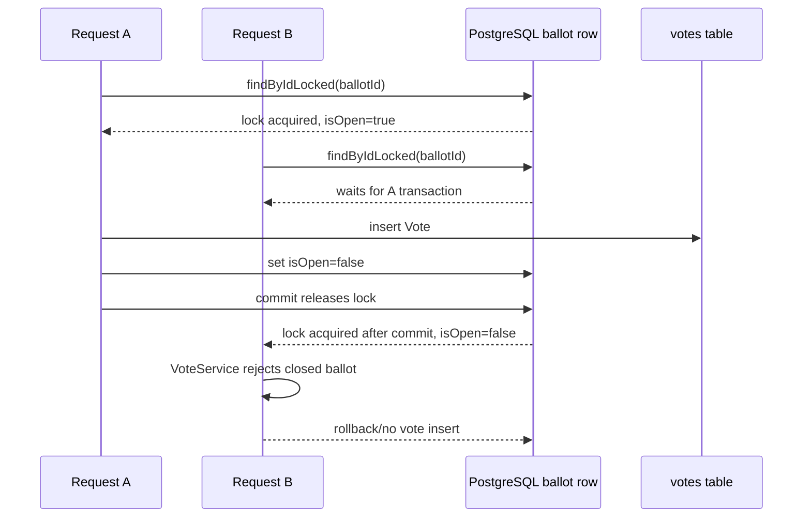

# Concurrency and Transactions

[Documentation Index](README.md) | [Português](../pt/concurrency-transactions.md)

## Transaction Boundaries

`VoteService.create` is annotated with `@Transactional`. Candidate lookup, locked ballot lookup, validation, vote insert, ballot close, and event publishing are invoked inside the transaction started for this service method.

`VoteService.findResult` is annotated with `@Transactional(readOnly = true)` and delegates to a JPQL aggregation query.

`BallotService.changeState` is annotated with `@Transactional`. When called from `VoteService.create` through the Spring proxy, it participates in the existing transaction with default propagation. When called from `BallotGateway`, it starts its own transaction.

No custom isolation level is configured in the annotations or properties. The effective isolation is therefore the database/connection default.

## Locking

`BallotRepository.findByIdLocked` uses `@Lock(LockModeType.PESSIMISTIC_WRITE)` with JPQL `SELECT b FROM Ballot b WHERE b.id = :id`. With Hibernate and PostgreSQL this maps to a row-level write lock for the selected ballot row, equivalent in effect to a `SELECT ... FOR UPDATE` on that row.

The code does not define `@Version` fields, so there is no optimistic locking. The `votes` table has no uniqueness constraint that limits one vote per ballot.

## Concurrent Vote Scenario

If two vote requests target the same ballot through `VoteService.create`, request B waits for request A's pessimistic lock to be released. After A commits, B obtains the lock and evaluates the current ballot state. Since A closes the ballot before commit, B sees `isOpen=false` under the usual PostgreSQL read-committed behavior and is rejected by the closed-ballot validation.

## Guarantees by Layer

Application code guarantees, on the `VoteService.create` path, that a vote is saved only after candidate existence, ballot existence, candidate-election membership, `isOpen`, and temporal-window checks pass. The same application path closes the ballot after saving the vote.

ORM/JPA provides entity persistence and the pessimistic lock requested by `@Lock(PESSIMISTIC_WRITE)`.

The transaction makes vote insertion and ballot state update part of the same database transaction. If a `ResponseStatusException` is thrown before the save, the vote is not saved. If persistence fails after the vote save and before commit, the transaction rolls back database changes.

The database enforces non-null columns, foreign keys produced by JPA schema generation, the unique `users.email` constraint, and row-level locking for the locked ballot query.

## Remaining Limits

The database does not independently prevent multiple votes for the same ballot. The single-vote behavior for a ballot depends on the `VoteService.create` flow using `findByIdLocked` and closing the ballot in the same transaction.

`BallotService.changeState` itself does not use `findByIdLocked`. Concurrent WebSocket open/close commands can overwrite each other according to transaction ordering; the final state is whichever committed assignment is last. There is no optimistic version check.

`BallotService.changeState` publishes the WebSocket event inside the transaction. The code does not register an after-commit callback, so the publish call is not explicitly delayed until after database commit.
