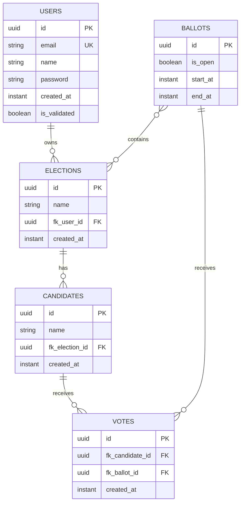

# Domain Model

[Documentation Index](README.md) | [Português](../pt/domain-model.md)

## Entities

`User` is stored in `users` and identified by a UUID generated with Hibernate UUID version 7. It has unique non-null `email`, non-null `name`, non-null `password`, non-null `createdAt`, and non-null `isValidated`. `@PrePersist` sets `createdAt = Instant.now()` and `isValidated = false`.

`Election` is stored in `elections` and identified by a UUID v7. It has non-null `name`, non-null `createdAt`, and a lazy `@ManyToOne` association to `User` through `fk_user_id`. `@PrePersist` sets `createdAt`. The table declares index `idx__election_user_id` on `fk_user_id`.

`Candidate` is stored in `candidates` and identified by a UUID v7. It has non-null `name`, non-null `createdAt`, and an eager `@ManyToOne` association to `Election` through `fk_election_id`. The table declares index `idx_candidate_election_id` on `fk_election_id`.

`Ballot` is stored in `ballots` and identified by a UUID v7. It has an eager `@ManyToMany` set of elections through join table `ballot_election`, non-null `isOpen`, non-null `startAt`, and non-null `endAt`. `@PrePersist` sets `isOpen = false`. The join table declares index `idx_ballot_election_election_ballot` on `fk_election_id, fk_ballot_id`.

`Vote` is stored in `votes` and identified by a UUID v7. It has eager non-null `@ManyToOne` associations to `Candidate` and `Ballot` through `fk_candidate_id` and `fk_ballot_id`, plus non-null `createdAt`. `@PrePersist` sets `createdAt`. The table declares index `idx_vote_candidate_ballot_id` on `fk_candidate_id, fk_ballot_id`.

## Relationship Model

The code does not define cascade operations on these relationships. It also does not define optimistic version fields or database uniqueness constraints for votes per ballot.
