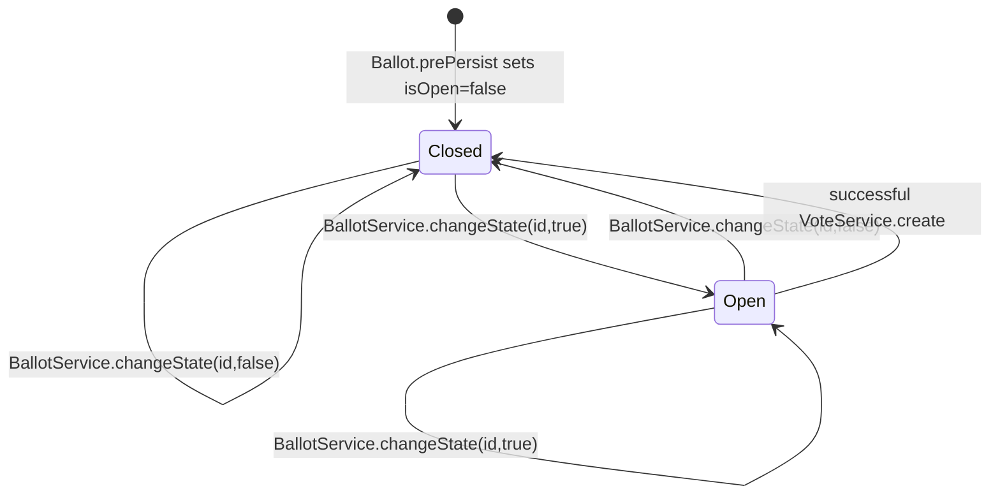

# Elections and Ballots

[Documentation Index](README.md) | [Português](../pt/elections-ballots.md)

## Elections

`ElectionService.create` requires an authenticated user id supplied by `ElectionController` through `@AuthenticationPrincipal`. It resolves the user with `UserService.findById`, creates an `Election`, sets its name and user, saves it, and returns `ElectionResponseDto`.

`ElectionService.findManyByUser` verifies the user exists and returns `ElectionRepository.findByUserId(userId, pageable)` mapped to DTOs.

`update` only changes `name` when `UpdateElectionDto.name()` is not null. `delete` removes the loaded election. The code does not enforce ballot/vote lifecycle rules before updating or deleting an election.

## Candidates

`CandidateService.create` resolves the target election with `ElectionService.findById`, creates the candidate, associates it with that election, saves it, and returns `CandidateResponseDto`. Candidates are listed by election through `CandidateRepository.findManyByElectionId`.

## Ballots

`BallotService.create` rejects `startAt >= endAt`. It resolves every id in `CreateBallotDto.electionsId()` through `ElectionService.findById`, stores the resulting set on the ballot, sets `startAt` and `endAt`, and saves it. `Ballot.prePersist` initializes `isOpen` to `false`.

`BallotService.changeState(id, isOpen)` is the only implemented state transition method. It is invoked by WebSocket commands and by `VoteService.create` after saving a vote. It loads the ballot, assigns the requested boolean value, saves the ballot, and publishes a `BallotEvent` with type `OPENED` or `CLOSED`.

`BallotService.delete` allows deletion only before `startAt`. If current time is greater than or equal to `startAt`, it returns `400 BAD_REQUEST` with `Não é possível deletar uma urna que já foi iniciada`.

## State

The only persisted ballot state is boolean `isOpen`. Time-based eligibility is not represented as a persisted state; it is evaluated during voting and deletion.

The code does not check `startAt`/`endAt` before opening or closing a ballot through WebSocket. Those timestamps are enforced for vote registration and for deletion.
