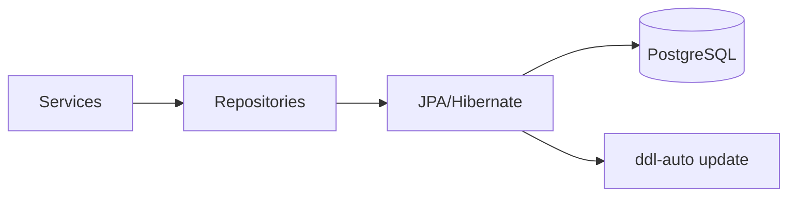

# Persistence

[Documentation Index](README.md) | [Português](../pt/persistence.md)

The persistence layer uses Spring Data JPA and Hibernate. `application.properties` configures PostgreSQL with `spring.datasource.url`, `spring.datasource.username`, `spring.datasource.password`, and `org.hibernate.dialect.PostgreSQLDialect`. Schema management is controlled by `spring.jpa.hibernate.ddl-auto=${JPA_DDL_AUTO:update}`. No Flyway, Liquibase, SQL migration files, or schema DDL files are present.

## Repositories

`UserRepository extends JpaRepository<User, UUID>` and declares `findByEmail(String email)`.

`ElectionRepository extends JpaRepository<Election, UUID>` and declares `findByUserId(UUID userId, Pageable pageable)`.

`CandidateRepository extends JpaRepository<Candidate, UUID>` and declares `findManyByElectionId(UUID id, Pageable pageable)`.

`BallotRepository extends JpaRepository<Ballot, UUID>` and declares two custom methods: `findByUserId`, using JPQL joins across `Ballot.elections` and `Election.user`, and `findByIdLocked`, using a pessimistic write lock.

`VoteRepository extends JpaRepository<Vote, UUID>` and declares `findResult(electionId, ballotId)`, a JPQL constructor query returning `VoteResultDto(count, CandidateResponseDto)`, grouped by candidate and ordered by count descending.

## Entities and Loading

`Election.user` is lazy. `Candidate.election`, `Ballot.elections`, `Vote.candidate`, and `Vote.ballot` are eager. No entity defines cascade settings.

All entity ids use `@UuidGenerator(style = UuidGenerator.Style.VERSION_7)`. Temporal fields are `Instant`.

## Constraints and Indexes

The code declares non-null columns for most scalar fields and vote foreign-key joins. `User.email` is unique and non-null. Election and candidate foreign-key join columns are not marked nullable in the annotation, while vote join columns and ballot join-table columns are explicitly non-null.

Declared indexes:

- `idx__election_user_id` on `elections.fk_user_id`.
- `idx_candidate_election_id` on `candidates.fk_election_id`.
- `idx_ballot_election_election_ballot` on `ballot_election(fk_election_id, fk_ballot_id)`.
- `idx_vote_candidate_ballot_id` on `votes(fk_candidate_id, fk_ballot_id)`.

These indexes align with implemented lookups and joins for listing elections by user, listing candidates by election, finding ballots by election owner, and aggregating votes by candidate/ballot.

