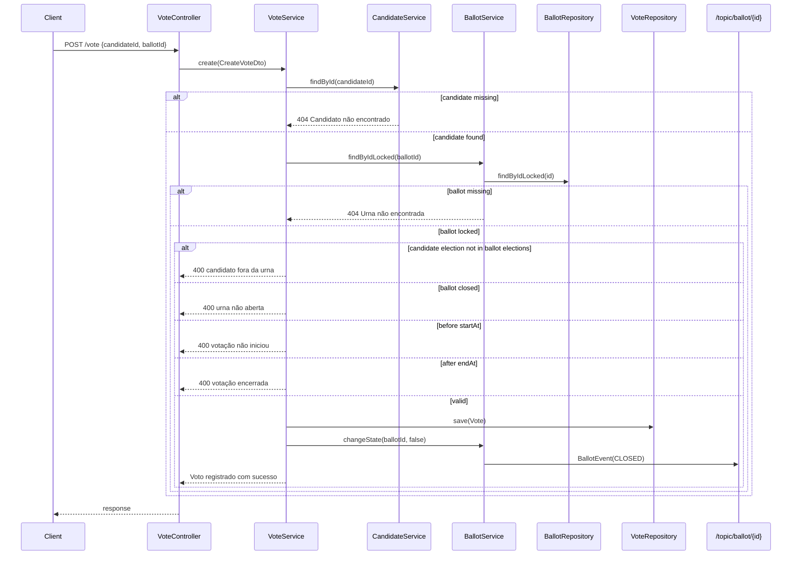

# Voting Flow

[Documentation Index](README.md) | [Português](../pt/voting-flow.md)

The vote registration entry point is `POST /vote` in `VoteController.create`. The request body is `CreateVoteDto(candidateId, ballotId)`. The controller does not annotate the DTO with `@Valid`; the service relies on downstream lookups and Java method calls for failure behavior.

`VoteService.create` is annotated with `@Transactional`. Inside that transaction it resolves the candidate with `CandidateService.findById(candidateId)`. Missing candidates cause `404 NOT_FOUND` with `Candidato não encontrado`.

The ballot is resolved with `BallotService.findByIdLocked(ballotId)`, which calls `BallotRepository.findByIdLocked`. That repository method uses `@Lock(LockModeType.PESSIMISTIC_WRITE)` and JPQL `SELECT b FROM Ballot b WHERE b.id = :id`. Missing ballots cause `404 NOT_FOUND` with `Urna não encontrada`.

After both entities are available, the service checks whether the candidate's election is present in the ballot's `elections` set. If no ballot election has the same id as `candidate.getElection().getId()`, the operation fails with `400 BAD_REQUEST` and `Esse candidato não faz parte de nenhuma eleição dessa urna`.

Then the service checks `ballot.getIsOpen()`. A closed ballot fails with `400 BAD_REQUEST` and `A urna não está aberta`.

The temporal window is checked against `new Date().toInstant()`. If `now < startAt`, the service returns `400 BAD_REQUEST` with `Essa votação ainda não iniciou`. If `now > endAt`, it returns `400 BAD_REQUEST` with `Essa votação já encerrou`.

When validations pass, the service creates a new `Vote`, sets the candidate and ballot, saves it through `VoteRepository.save`, then calls `BallotService.changeState(ballotId, false)`. `changeState` loads the ballot, sets `isOpen` to `false`, saves the ballot, and publishes a `BallotEvent` with type `CLOSED` to `/topic/ballot/{id}`.

The successful response body is the string `Voto registrado com sucesso`.

The main invariants that block invalid votes are implemented in `VoteService.create`: candidate must exist, ballot must exist and be locked, candidate's election must belong to the ballot, ballot must be open, and current time must be inside the configured ballot window.
