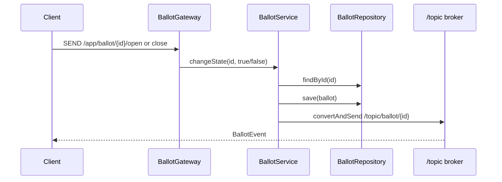

# WebSocket

[Documentation Index](README.md) | [Português](../pt/websocket.md)

`WebSocketConfig` enables STOMP over WebSocket with endpoint `/ws`. The configured application destination prefix is `/app`, and the simple in-memory broker handles `/topic`.

`WebSocketSecurityConfig` permits null destinations, requires authentication for `/app/ballot/*/open` and `/app/ballot/*/close`, permits subscriptions to `/topic/ballot/**`, and denies other messages. `SecurityConfig` permits the HTTP `/ws` handshake path.

## Commands

`BallotGateway` is annotated with `@MessageMapping("/ballot/{id}")`.

- Client sends to `/app/ballot/{id}/open`; `openBallot(UUID id)` calls `BallotService.changeState(id, true)`.
- Client sends to `/app/ballot/{id}/close`; `closeBallot(UUID id)` calls `BallotService.changeState(id, false)`.

## Events

`BallotService.changeState` publishes to `/topic/ballot/{id}` with payload `BallotEvent(ballotId, type, occurredAt)`. `type` is `OPENED` when `isOpen=true` and `CLOSED` when `isOpen=false`.

The successful vote path also calls `BallotService.changeState(ballotId, false)`, so it publishes a `CLOSED` event.

There is no separate WebSocket adapter interface between `BallotService` and Spring messaging. The service depends directly on `SimpMessagingTemplate`.
