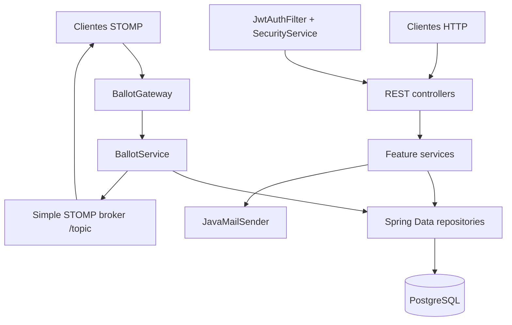

# Documentação do Servidor do Vox

[README raiz](../../README.md) | [English](../en/README.md)

Este repositório é o componente servidor do projeto Vox. Trata-se de um backend Spring Boot cujo domínio implementado cobre usuários, eleições, candidatos, urnas, votos e notificações de estado de urna. Estas páginas documentam o comportamento visível no código-fonte atual.

## Mapa

- [Arquitetura](architecture.md)
- [Modelo de Domínio](domain-model.md)
- [Fluxo de Votação](voting-flow.md)
- [Eleições e Urnas](elections-ballots.md)
- [Concorrência e Transações](concurrency-transactions.md)
- [Persistência](persistence.md)
- [API HTTP](http-api.md)
- [WebSocket](websocket.md)
- [Validações e Invariantes](validation-invariants.md)
- [Testes](testing.md)
- [Configuração e Deployment](configuration-deployment.md)

## Componentes em Alto Nível

As dependências principais entre services são dependências diretas por construtor do Spring. A implementação atual não possui command objects de aplicação, repository ports ou interfaces de adapter para persistência.
