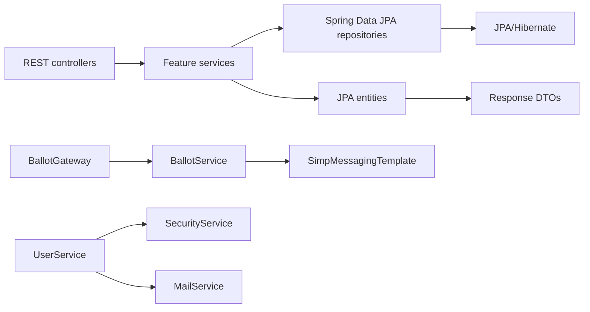
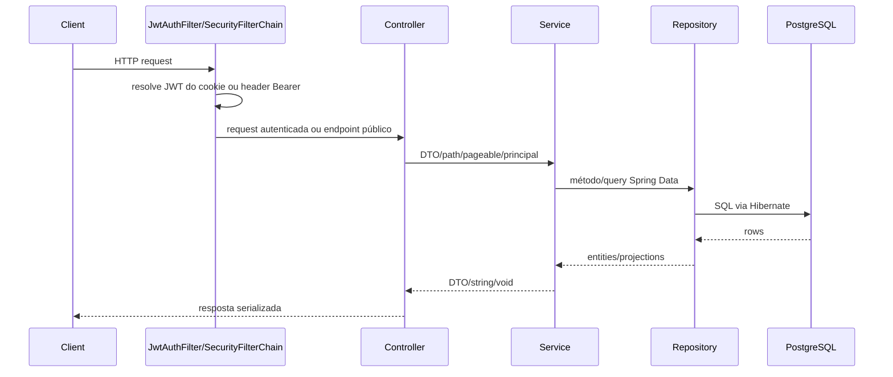

# Arquitetura

[Índice](README.md) | [English](../en/architecture.md)

## Forma em Runtime

A aplicação é um Spring Boot iniciado por `dev.joaopdias.vox.VoxApplication`. O código de features fica em `dev.joaopdias.vox.core`, com pacotes para `user`, `election`, `candidate`, `ballot` e `vote`. Código transversal fica em `dev.joaopdias.vox.shared`, e configuração Spring fica em `dev.joaopdias.vox.config`.

A fronteira implementada entre interfaces externas e operações de negócio é a fronteira controller/service:

- REST controllers são anotados com `@RestController` e delegam para feature services.
- `BallotGateway` é um controller STOMP anotado com `@Controller` e `@MessageMapping`.
- Services concentram as validações e orquestrações observáveis.
- Repositories são interfaces Spring Data JPA usadas diretamente pelos services.
- Entities são modelos JPA de persistência e também possuem métodos `toResponseDto()`.

Esta não é uma implementação estrita de arquitetura hexagonal ou clean architecture, porque os services dependem diretamente de repositories Spring Data, as entities expõem conversão para DTOs, e `BallotService` depende diretamente de `SimpMessagingTemplate`.

## Módulos e Responsabilidades

`core.user` gerencia ciclo de vida da conta, credenciais, status de validação, delegação de criação/renovação de JWT e envio de email. `UserService` depende de `UserRepository`, `SecurityService` e `MailService`.

`core.election` gerencia eleições pertencentes a usuários. `ElectionService` depende de `ElectionRepository` e `UserService` para resolver o dono.

`core.candidate` gerencia candidatos e sua associação com eleição. `CandidateService` resolve a eleição via `ElectionService` antes de salvar o candidato.

`core.ballot` gerencia urnas, conjunto de eleições, estado aberto/fechado, janela temporal, regra de exclusão e notificações STOMP. `BallotService` depende de `BallotRepository`, `ElectionService` e `SimpMessagingTemplate`.

`core.vote` registra votos e lê resultados agregados. `VoteService` coordena `CandidateService`, `BallotService` e `VoteRepository`.

`shared.security` contém o filtro servlet JWT e o record de principal autenticado. `shared.services.SecurityService` cria e valida JWTs HMAC-SHA256 manualmente e usa Argon2 para hash de senha. `shared.services.MailService` renderiza templates HTML no classpath e envia email por `JavaMailSender`.

## Direção das Dependências

Services chamam outros services quando precisam de uma entidade pertencente a outra feature. Por exemplo, `VoteService.create` chama `CandidateService.findById` e `BallotService.findByIdLocked`; `CandidateService.create` chama `ElectionService.findById`; `ElectionService.create` chama `UserService.findById`.

## Caminho de uma Request

## Integrações Externas

PostgreSQL é o datasource configurado. Email usa Spring Mail com propriedades SMTP. WebSocket/STOMP usa Spring WebSocket com simple broker habilitado para `/topic`. O build Maven ainda inclui Spring Cloud Stream e Rabbit binder, mas `application.properties` não configura mais RabbitMQ e não há funções de stream binding nem configuração de channels no código-fonte. O `compose.yaml` atual não define serviços RabbitMQ ou Redis. Redis não é configurado em `application.properties`, e não há uso de Redis repository, template ou cache no código.
