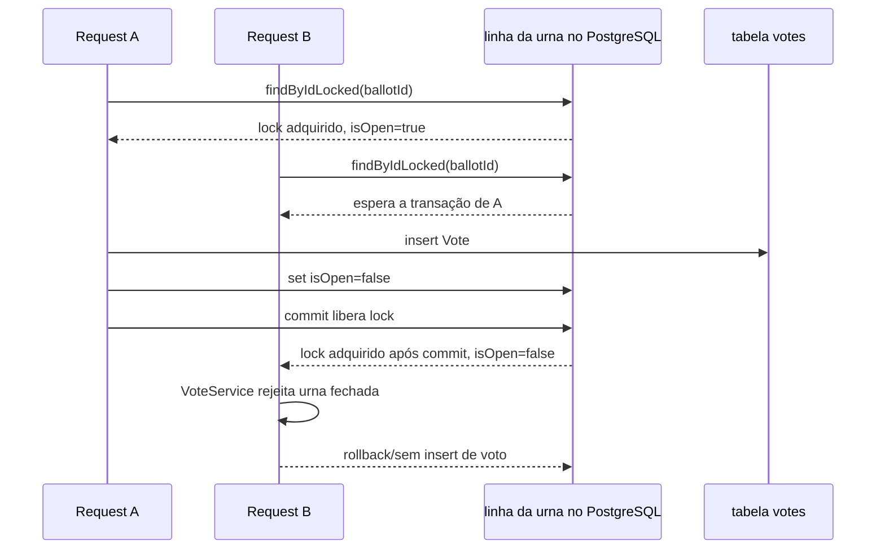

# Concorrência e Transações

[Índice](README.md) | [English](../en/concurrency-transactions.md)

## Fronteiras Transacionais

`VoteService.create` é anotado com `@Transactional`. Busca do candidato, busca bloqueante da urna, validação, insert do voto, fechamento da urna e publicação de evento são invocados dentro da transação iniciada por esse método de service.

`VoteService.findResult` é anotado com `@Transactional(readOnly = true)` e delega para uma query JPQL de agregação.

`BallotService.changeState` é anotado com `@Transactional`. Quando chamado por `VoteService.create` através do proxy Spring, participa da transação existente com a propagação padrão. Quando chamado por `BallotGateway`, inicia sua própria transação.

Nenhum isolation level customizado é configurado nas anotações ou propriedades. O isolamento efetivo é, portanto, o default do banco/conexão.

## Locks

`BallotRepository.findByIdLocked` usa `@Lock(LockModeType.PESSIMISTIC_WRITE)` com JPQL `SELECT b FROM Ballot b WHERE b.id = :id`. Com Hibernate e PostgreSQL isso mapeia para lock de escrita em nível de linha para a urna selecionada, equivalente em efeito a um `SELECT ... FOR UPDATE` nessa linha.

O código não define campos `@Version`, então não há optimistic locking. A tabela `votes` não possui constraint de unicidade limitando um voto por urna.

## Cenário de Votos Concorrentes

Se duas requests de voto miram a mesma urna pelo caminho `VoteService.create`, a request B espera o lock pessimista da request A ser liberado. Depois do commit de A, B obtém o lock e avalia o estado atual da urna. Como A fecha a urna antes do commit, B enxerga `isOpen=false` no comportamento usual de read committed do PostgreSQL e é rejeitada pela validação de urna fechada.

## Garantias por Camada

O código de aplicação garante, no caminho `VoteService.create`, que um voto só é salvo depois das validações de existência do candidato, existência da urna, pertencimento candidato-eleição-urna, `isOpen` e janela temporal. O mesmo caminho fecha a urna depois de salvar o voto.

ORM/JPA fornece persistência de entidades e o lock pessimista solicitado por `@Lock(PESSIMISTIC_WRITE)`.

A transação coloca o insert do voto e a atualização de estado da urna na mesma transação de banco. Se uma `ResponseStatusException` é lançada antes do save, o voto não é salvo. Se a persistência falhar depois do save e antes do commit, a transação reverte as mudanças no banco.

O banco reforça colunas não nulas, foreign keys geradas pelo schema JPA, unicidade de `users.email` e lock em nível de linha para a query bloqueante da urna.

## Limites Restantes

O banco não impede, sozinho, múltiplos votos para a mesma urna. O comportamento de voto único por urna depende do fluxo `VoteService.create` usar `findByIdLocked` e fechar a urna na mesma transação.

`BallotService.changeState` em si não usa `findByIdLocked`. Comandos WebSocket concorrentes de abrir/fechar podem sobrescrever um ao outro conforme a ordem das transações; o estado final é a atribuição que commitar por último. Não há verificação por versão otimista.

`BallotService.changeState` publica o evento WebSocket dentro da transação. O código não registra callback after-commit, então a chamada de publish não é explicitamente adiada até depois do commit do banco.
