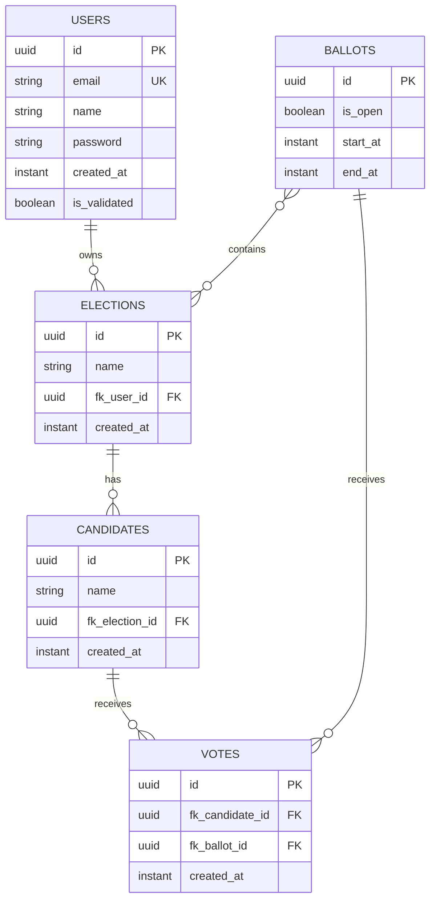

# Modelo de Domínio

[Índice](README.md) | [English](../en/domain-model.md)

## Entidades

`User` é persistido em `users` e identificado por UUID gerado pelo Hibernate em versão 7. Possui `email` único e não nulo, `name` não nulo, `password` não nulo, `createdAt` não nulo e `isValidated` não nulo. `@PrePersist` define `createdAt = Instant.now()` e `isValidated = false`.

`Election` é persistido em `elections` e identificado por UUID v7. Possui `name` não nulo, `createdAt` não nulo e associação lazy `@ManyToOne` com `User` por `fk_user_id`. `@PrePersist` define `createdAt`. A tabela declara o índice `idx__election_user_id` em `fk_user_id`.

`Candidate` é persistido em `candidates` e identificado por UUID v7. Possui `name` não nulo, `createdAt` não nulo e associação eager `@ManyToOne` com `Election` por `fk_election_id`. A tabela declara o índice `idx_candidate_election_id` em `fk_election_id`.

`Ballot` é persistido em `ballots` e identificado por UUID v7. Possui um conjunto eager `@ManyToMany` de eleições pela join table `ballot_election`, `isOpen` não nulo, `startAt` não nulo e `endAt` não nulo. `@PrePersist` define `isOpen = false`. A join table declara o índice `idx_ballot_election_election_ballot` em `fk_election_id, fk_ballot_id`.

`Vote` é persistido em `votes` e identificado por UUID v7. Possui associações eager e não nulas `@ManyToOne` com `Candidate` e `Ballot` por `fk_candidate_id` e `fk_ballot_id`, além de `createdAt` não nulo. `@PrePersist` define `createdAt`. A tabela declara o índice `idx_vote_candidate_ballot_id` em `fk_candidate_id, fk_ballot_id`.

## Modelo de Relacionamentos

O código não define operações de cascade nesses relacionamentos. Também não define campos de versão otimista nem constraints de unicidade para votos por urna.
