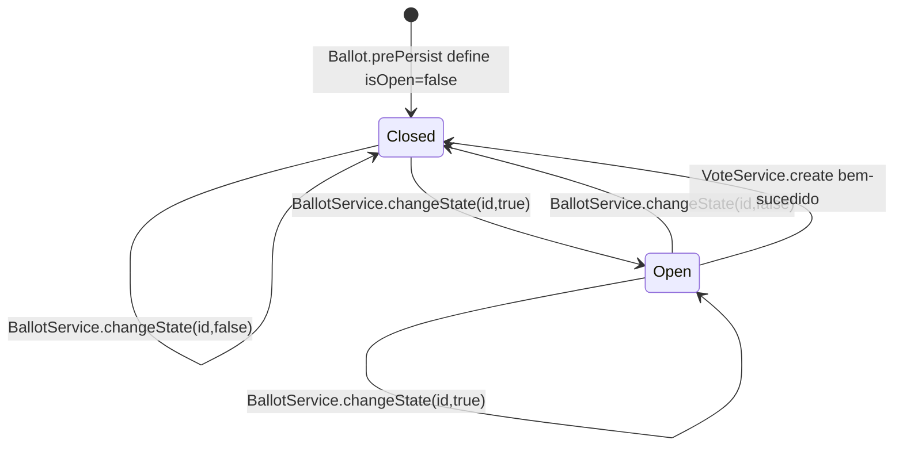

# Eleições e Urnas

[Índice](README.md) | [English](../en/elections-ballots.md)

## Eleições

`ElectionService.create` requer o id do usuário autenticado fornecido por `ElectionController` via `@AuthenticationPrincipal`. Ele resolve o usuário com `UserService.findById`, cria uma `Election`, define nome e usuário, salva e retorna `ElectionResponseDto`.

`ElectionService.findManyByUser` verifica se o usuário existe e retorna `ElectionRepository.findByUserId(userId, pageable)` mapeado para DTOs.

`update` altera apenas `name` quando `UpdateElectionDto.name()` não é null. `delete` remove a eleição carregada. O código não aplica regras de ciclo de vida de urna/voto antes de atualizar ou excluir uma eleição.

## Candidatos

`CandidateService.create` resolve a eleição alvo com `ElectionService.findById`, cria o candidato, associa à eleição, salva e retorna `CandidateResponseDto`. Candidatos são listados por eleição via `CandidateRepository.findManyByElectionId`.

## Urnas

`BallotService.create` rejeita `startAt >= endAt`. Ele resolve cada id em `CreateBallotDto.electionsId()` por `ElectionService.findById`, armazena o set resultante na urna, define `startAt` e `endAt` e salva. `Ballot.prePersist` inicializa `isOpen` como `false`.

`BallotService.changeState(id, isOpen)` é o único método implementado de transição de estado. Ele é chamado por comandos WebSocket e por `VoteService.create` depois de salvar um voto. O método carrega a urna, atribui o boolean solicitado, salva a urna e publica um `BallotEvent` com tipo `OPENED` ou `CLOSED`.

`BallotService.delete` permite exclusão apenas antes de `startAt`. Se o horário atual for maior ou igual a `startAt`, retorna `400 BAD_REQUEST` com `Não é possível deletar uma urna que já foi iniciada`.

## Estado

O único estado persistido da urna é o boolean `isOpen`. A elegibilidade temporal não é representada como estado persistido; ela é avaliada durante votação e exclusão.

O código não verifica `startAt`/`endAt` antes de abrir ou fechar uma urna via WebSocket. Esses timestamps são aplicados no registro de voto e na exclusão.
