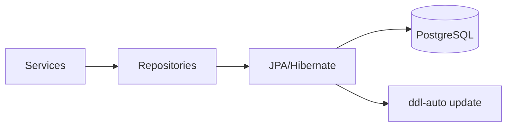

# Persistência

[Índice](README.md) | [English](../en/persistence.md)

A camada de persistência usa Spring Data JPA e Hibernate. `application.properties` configura PostgreSQL com `spring.datasource.url`, `spring.datasource.username`, `spring.datasource.password` e `org.hibernate.dialect.PostgreSQLDialect`. A gestão de schema é controlada por `spring.jpa.hibernate.ddl-auto=${JPA_DDL_AUTO:update}`. Não há Flyway, Liquibase, arquivos SQL de migration ou DDL de schema no projeto.

## Repositories

`UserRepository extends JpaRepository<User, UUID>` e declara `findByEmail(String email)`.

`ElectionRepository extends JpaRepository<Election, UUID>` e declara `findByUserId(UUID userId, Pageable pageable)`.

`CandidateRepository extends JpaRepository<Candidate, UUID>` e declara `findManyByElectionId(UUID id, Pageable pageable)`.

`BallotRepository extends JpaRepository<Ballot, UUID>` e declara dois métodos customizados: `findByUserId`, usando joins JPQL entre `Ballot.elections` e `Election.user`, e `findByIdLocked`, usando lock pessimista de escrita.

`VoteRepository extends JpaRepository<Vote, UUID>` e declara `findResult(electionId, ballotId)`, uma constructor query JPQL que retorna `VoteResultDto(count, CandidateResponseDto)`, agrupada por candidato e ordenada por contagem decrescente.

## Entities e Carregamento

`Election.user` é lazy. `Candidate.election`, `Ballot.elections`, `Vote.candidate` e `Vote.ballot` são eager. Nenhuma entity define cascade.

Todos os ids de entities usam `@UuidGenerator(style = UuidGenerator.Style.VERSION_7)`. Campos temporais são `Instant`.

## Constraints e Índices

O código declara colunas não nulas para a maior parte dos campos escalares e joins de foreign key de voto. `User.email` é único e não nulo. Join columns de election e candidate não são marcadas como nullable na anotação, enquanto join columns de vote e da join table de ballot são explicitamente não nulas.

Índices declarados:

- `idx__election_user_id` em `elections.fk_user_id`.
- `idx_candidate_election_id` em `candidates.fk_election_id`.
- `idx_ballot_election_election_ballot` em `ballot_election(fk_election_id, fk_ballot_id)`.
- `idx_vote_candidate_ballot_id` em `votes(fk_candidate_id, fk_ballot_id)`.

Esses índices acompanham buscas e joins implementados para listar eleições por usuário, listar candidatos por eleição, encontrar urnas pelo dono das eleições e agregar votos por candidato/urna.

