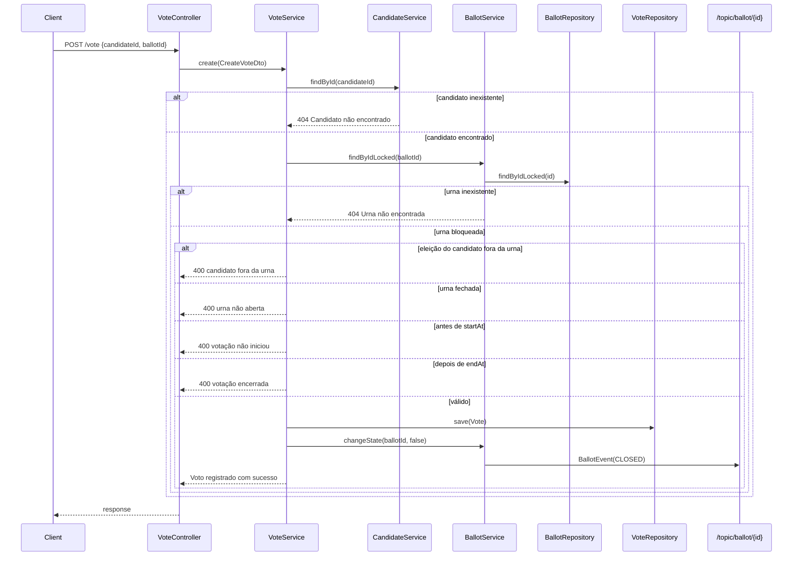

# Fluxo de Votação

[Índice](README.md) | [English](../en/voting-flow.md)

O ponto de entrada do registro de voto é `POST /vote` em `VoteController.create`. O body é `CreateVoteDto(candidateId, ballotId)`. O controller não anota o DTO com `@Valid`; o service depende das buscas subsequentes e das chamadas Java para produzir falhas.

`VoteService.create` é anotado com `@Transactional`. Dentro dessa transação, ele resolve o candidato com `CandidateService.findById(candidateId)`. Candidatos inexistentes geram `404 NOT_FOUND` com `Candidato não encontrado`.

A urna é resolvida com `BallotService.findByIdLocked(ballotId)`, que chama `BallotRepository.findByIdLocked`. Esse método usa `@Lock(LockModeType.PESSIMISTIC_WRITE)` e JPQL `SELECT b FROM Ballot b WHERE b.id = :id`. Urnas inexistentes geram `404 NOT_FOUND` com `Urna não encontrada`.

Depois que as duas entidades estão disponíveis, o service verifica se a eleição do candidato está presente no set `elections` da urna. Se nenhuma eleição da urna tiver o mesmo id de `candidate.getElection().getId()`, a operação falha com `400 BAD_REQUEST` e `Esse candidato não faz parte de nenhuma eleição dessa urna`.

Em seguida o service verifica `ballot.getIsOpen()`. Uma urna fechada falha com `400 BAD_REQUEST` e `A urna não está aberta`.

A janela temporal é verificada contra `new Date().toInstant()`. Se `now < startAt`, o service retorna `400 BAD_REQUEST` com `Essa votação ainda não iniciou`. Se `now > endAt`, retorna `400 BAD_REQUEST` com `Essa votação já encerrou`.

Quando as validações passam, o service cria um novo `Vote`, define candidato e urna, salva por `VoteRepository.save` e então chama `BallotService.changeState(ballotId, false)`. `changeState` carrega a urna, define `isOpen` como `false`, salva a urna e publica um `BallotEvent` com tipo `CLOSED` em `/topic/ballot/{id}`.

A resposta de sucesso é a string `Voto registrado com sucesso`.

As principais invariantes que impedem votos inválidos estão em `VoteService.create`: candidato deve existir, urna deve existir e ser bloqueada, a eleição do candidato deve pertencer à urna, a urna deve estar aberta e o horário atual deve estar dentro da janela configurada da urna.
