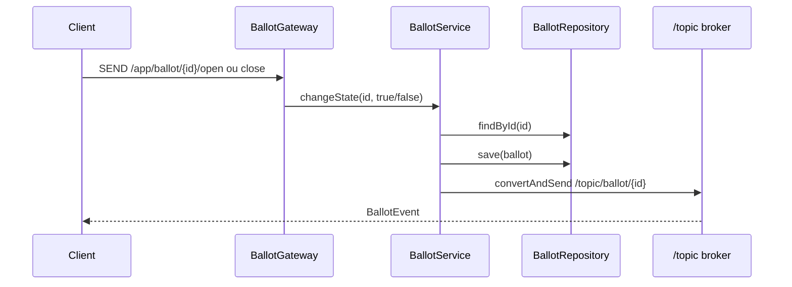

# WebSocket

[Índice](README.md) | [English](../en/websocket.md)

`WebSocketConfig` habilita STOMP sobre WebSocket com endpoint `/ws`. O prefixo de destinos de aplicação é `/app`, e o simple broker em memória atende `/topic`.

`WebSocketSecurityConfig` permite destinos nulos, exige autenticação para `/app/ballot/*/open` e `/app/ballot/*/close`, permite subscriptions em `/topic/ballot/**` e nega outras mensagens. `SecurityConfig` permite o path HTTP de handshake `/ws`.

## Comandos

`BallotGateway` é anotado com `@MessageMapping("/ballot/{id}")`.

- Cliente envia para `/app/ballot/{id}/open`; `openBallot(UUID id)` chama `BallotService.changeState(id, true)`.
- Cliente envia para `/app/ballot/{id}/close`; `closeBallot(UUID id)` chama `BallotService.changeState(id, false)`.

## Eventos

`BallotService.changeState` publica em `/topic/ballot/{id}` com payload `BallotEvent(ballotId, type, occurredAt)`. `type` é `OPENED` quando `isOpen=true` e `CLOSED` quando `isOpen=false`.

O caminho de voto bem-sucedido também chama `BallotService.changeState(ballotId, false)`, então publica um evento `CLOSED`.

Não existe uma interface separada de adapter WebSocket entre `BallotService` e Spring Messaging. O service depende diretamente de `SimpMessagingTemplate`.
